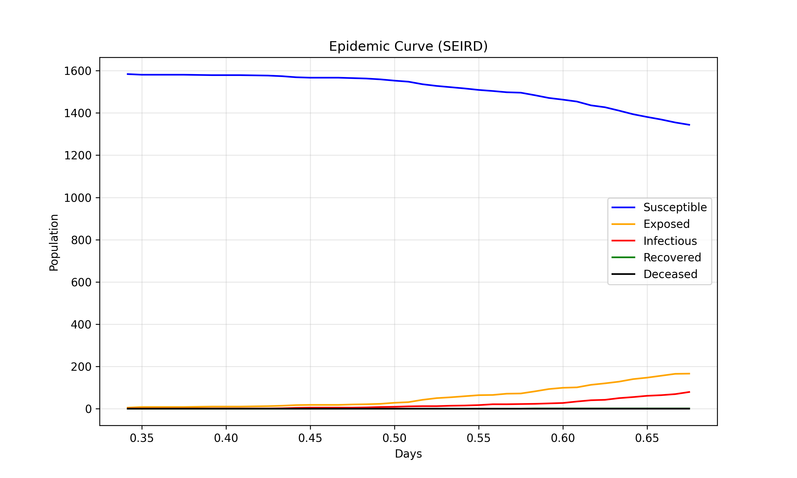
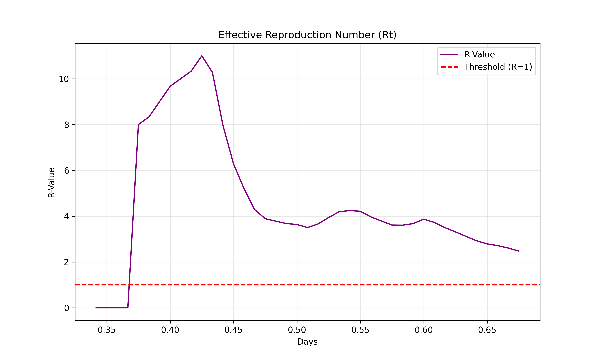
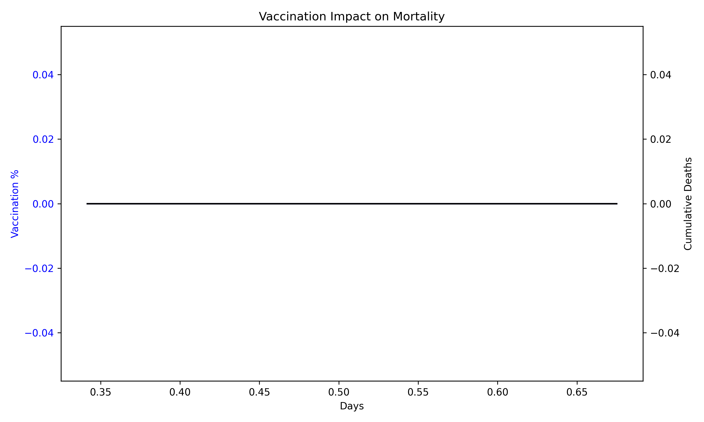

# COVID-19 Simulation Report

**Date**: 2025-12-21 22:35:33

## Executive Summary

- **Total Deaths**: 0
- **Active Cases**: 79
- **Recovered**: 1

## Visualizations

## Understanding the Metrics

### SEIR Model
- **Susceptible**: Healthy individuals who can catch the virus.
- **Exposed**: Infected but not yet contagious (incubation).
- **Infectious**: Actively spreading the virus to neighbors.
- **Recovered**: Generated immunity after infection.

### R-Value (Rt)
- **Rt > 1.0**: Outbreak is growing exponentially.
- **Rt < 1.0**: Outbreak is under control/decaying.
